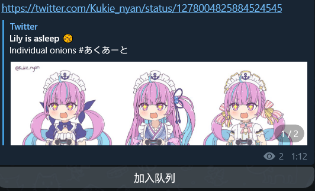
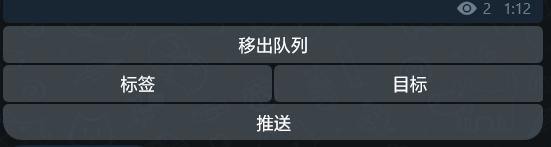
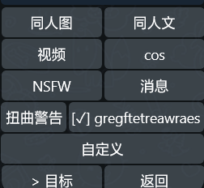
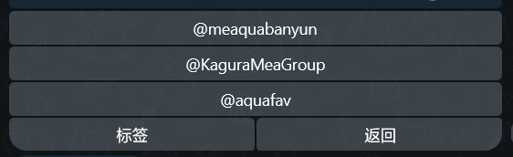

# 如何使用？

## 主按钮页

在监视器频道（即机器人监控其中的消息，并为其加上功能按钮供使用的频道）中，每条消息底部都会带有一个“加入队列“按钮，除非它来自本机器人或是一条指令，如图。



点按即可将这条消息的链接内容加入推送队列。注意：链接之外的内容会被无视，且只会处理其中的第一条链接。按钮会自动变化为如图：



- ”移出队列“：将这条消息的内容移出推送队列。
- ”标签“：为这条消息指定推送时要附带的标签。按钮将变为标签按钮页。
- ”目标“：为这条消息指定需要推送到的目标。按钮将变为目标按钮页。
  - 如果您不指定任何目标，消息会被推送至默认目标，即配置文件中 `"targets"` 数组的第一个。
  - 如果您在使用 `/push` 指令推送时指定了目标，则这里选择的目标将不生效。
- ”推送“：立即推送这条消息。

## 标签按钮页

标签按钮页如图。



- 标签按钮：为这条消息指定推送时要附带的标签。已选择的标签旁边将有 ”[✓]“。
- ”目标“：切换到目标按钮页。
- ”返回“：回到主按钮页。

## 目标按钮页

目标按钮页如图。各按钮的行为都与标签按钮页同理。



## 指令

- `/push`：立即推送队列中的所有内容。
    - 推送时可以用如下形式指定目标和标签。队列中的消息将**只会**被推送到指定的目标；指定的目标应为用户名，**且开头应有@**，否则将作为tag处理；队列中的消息将全部被**额外附加上**指定的标签：
```
/push @a_group a_tag @a_channel another_tag one_more_tag ...
```
- `/check`：检查当前推送队列中的内容。
- `/log_by_id`：将当前监视器改为用 ID 形式在配置文件中记录。
  - 原来记录的监视器用户名将被删除。
  - 由于私有频道/群组没有用户名，只有在执行过此操作后，您才可以将监视器转为私有。之后您也可以重新改为公开，而无需执行任何操作。
- `/start`：检查机器人是否在线，获取状态信息。
- `/restart`：远程重启机器人。
- `/commands`：列出所有可用指令，需注意列出的选项在当前的环境内不一定可用。